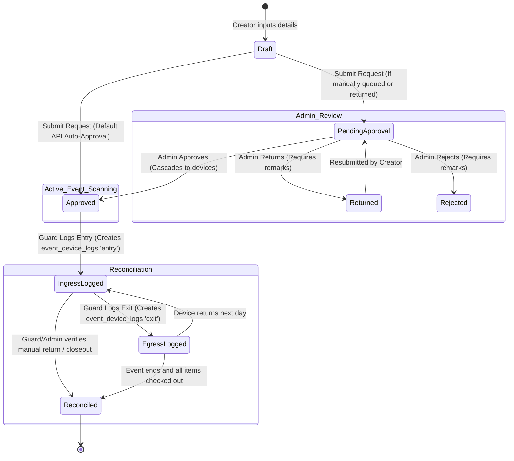

# Temporary Event Device Request Workflow

This document explains the end-to-end workflow for managing temporary event device requests (e.g., student-led exhibitions, prototype demonstrations, and organizational events) in the BYOD Campus Management System.

---

## 1. Workflow Diagram

The diagram below maps the states, transitions, and user roles involved in the lifecycle of a temporary event request, reflecting the auto-approval shortcut as well as the manual review queue paths:



---

## 2. Step-by-Step Process Flow

### Step 2.1: Request Submission (Submitter / Admin)
1. **Form Input:** Authorized users access the Event Request screen (handled by `TemporaryEventDeviceScreenController` or `TemporaryEventDeviceGuardScreenController`).
2. **Details Captured:**
   - **Header Info:** Student ID, Event Name, Organization, Responsible Person, Purpose, and Contact details.
   - **Dates:** Start Date and End Date.
   - **Attachment/Bypass Info:** Approval Document type (e.g., *Signed GPOA*, *Paper Approval*) and its Reference Number.
   - **Manifest Items:** List of temporary event devices. Each item requires Name, Brand, Model, Serial Number (optional/custom), Device Type, and Quantity.
3. **Date Validation:**
   - The Start Date must be on or before the End Date.
   - The event duration cannot exceed the system limit parameter `event_request_max_duration_days` (default: **7 days**), which is checked at submission.
4. **Draft Caching:** If the user exits the form midway, local session drafts are cached using a singleton helper to avoid losing data.
5. **Immediate Auto-Approval (Default Behavior):**
   > [!IMPORTANT]
   > To streamline operations, the backend service layer (`EventRequestService.java`) automatically sets the initial status of newly created requests to `"approved"`.
   > This cascades the `"approved"` status to all child devices in `event_request_devices` immediately, allowing them to pass campus gate security check-in without requiring manual intervention from an administrator.

### Step 2.2: Admin Review & Decisive Actions (Admin)
Although standard API submissions bypass the queue through immediate approval, the backend review endpoints remain fully active and functional to handle manual state transitions:
* **When Review is Active:** Requests can transition through the administrative review pipeline if they are manually inserted into the database with a `'pending'` status, or if they have been returned for correction.
* **Approve Request:** Sets request status to `approved`. This cascades the `approved` status to all manifest items under `event_request_devices`, marking them valid for campus gate clearance.
* **Return for Revision:** Sets status to `returned` and allows the admin to write correction requirements in the remarks. The submitter can then edit and resubmit the request.
* **Reject Request:** Sets status to `rejected` and requires remarks explaining the grounds for rejection.

### Step 2.3: Security Gate Ingress & Egress Scanning (Guard)
During the active event dates, guards use the **Temporary Event Device Guard Panel** (`TemporaryEventDeviceGuardScreenController`):
1. **Lookup:** The guard searches for the active request using the student's ID or event name.
2. **Manifest Review:** The guard physically inspects the items and checks them off on the UI table layout.
3. **Log Entry (Ingress):** The guard scans/clicks "Confirm Entry". This hits `/api/v1/event-requests/devices/log-entry`, inserting an `'entry'` log row into the `event_device_logs` table for each selected device.
4. **Log Exit (Egress):** When the student leaves, the guard checks off the items and clicks "Confirm Exit". This hits `/api/v1/event-requests/devices/log-exit`, inserting an `'exit'` log row into `event_device_logs`.
5. **Consecutive Scan Protection:** A database trigger `trg_event_device_logs_consecutive_events` automatically rejects consecutive entries/exits (e.g., double entry scans without a corresponding exit) to maintain gate log integrity.

### Step 2.4: Real-time Reconciliation (Guard & Admin)
* **Live Status Directory:** The view `v_event_device_status` derives the current status of each event device:
  - **`entry`**: The device is currently inside campus grounds.
  - **`exit`**: The device is currently checked out / outside campus.
* **Incident / Reconciliation Reporting:** At the end of the day or event, admins inspect the **Reconciliation Report** (`/api/v1/event-requests/devices/reconciliation-report`) to isolate unreturned hardware.

---

## 3. Database Schema Operations

The temporary event system relies on three tables and two views to store and map records:

```
                  ┌─────────────────┐
                  │ event_requests  │
                  └────────┬────────┘
                           │ 1
                           │
                           │ N
              ┌────────────▼────────────┐
              │ event_request_devices   ◄──────────┐
              └────────────┬────────────┘          │
                           │ 1                     │ 1
                           │                       │
                           │ N                     │ N
              ┌────────────▼────────────┐  ┌───────┴──────────────┐
              │    event_device_logs    │  │ v_event_device_status│
              └─────────────────────────┘  └──────────────────────┘
```

### 3.1 Tables

1. **`event_requests`**: Keeps the header record (event metadata, dates, documents, approval status, and remarks).
2. **`event_request_devices`**: Manifest table. Lists each hardware item, serial number, verification status, and quantity.
3. **`event_device_logs`**: Ingress/Egress logs. Each row represents a physical gate entry/exit event.

### 3.2 Views

* **`v_event_device_status`**: Combines `event_request_devices` with their latest `event_device_logs` entry to derive if a device is currently **inside** (`entry`) or **outside** (`exit`) the campus.
* **`v_active_event_requests`**: Joins `event_requests` with student profiles and sums up the total child device counts for active dashboard grids.

---

## 4. API Endpoints Reference

The following backend endpoints manage the event lifecycle:

| Action | Endpoint | Method | Role Constraints |
|---|---|---|---|
| **Create Request** | `/api/v1/event-requests` | `POST` | `admin` (or submitter) |
| **Get Guard Grid** | `/api/v1/event-requests/guard` | `GET` | `guard`, `admin` |
| **Get Manifest Devices** | `/api/v1/event-requests/{eventRequestId}/devices` | `GET` | `guard`, `admin` |
| **Approve Request** | `/api/v1/event-requests/{eventRequestId}/approve` | `PUT` | `admin` |
| **Return for Revision** | `/api/v1/event-requests/{eventRequestId}/return` | `PUT` | `admin` |
| **Reject Request** | `/api/v1/event-requests/{eventRequestId}/reject` | `PUT` | `admin` |
| **Log Device Entry** | `/api/v1/event-requests/devices/log-entry` | `POST` | `guard` |
| **Log Device Exit** | `/api/v1/event-requests/devices/log-exit` | `POST` | `guard` |
| **Reconcile Device** | `/api/v1/event-requests/devices/{eventDeviceId}/verify` | `PUT` | `guard`, `admin` |
| **Reconciliation Report**| `/api/v1/event-requests/devices/reconciliation-report` | `GET` | `admin`, `super_admin` |
