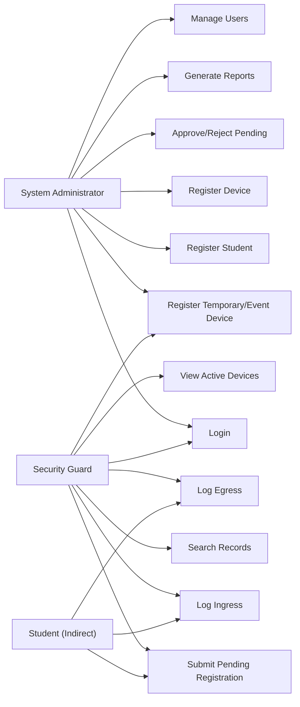

# 04 - Use Cases

## Actors

| Actor | Role |
| --- | --- |
| System Administrator | Manages official records, users, reports, approvals, and exceptions. |
| Security Guard | Searches records, logs ingress/egress, and submits pending records. |
| Student | Indirect actor who presents device and ownership details. |

## Use Case Overview

## UC-001 Login

| Item | Description |
| --- | --- |
| Actor | System Administrator, Security Guard |
| Goal | Access the system according to assigned role. |
| Preconditions | User account exists and is active. |
| Basic Flow | User opens application; enters username and password; system validates credentials; system opens the correct dashboard. |
| Alternative Flows | If role is Admin, show admin dashboard. If role is Guard, show guard dashboard. |
| Exceptions | Invalid credentials; inactive account; database connection error. |
| Postconditions | User session starts and role permissions are applied. |

## UC-002 Register Student

| Item | Description |
| --- | --- |
| Actor | System Administrator |
| Goal | Create an official student record. |
| Preconditions | Admin is logged in. |
| Basic Flow | Admin opens Student Management; enters student ID, name, course, section, contact, email, and status; system validates fields; system saves record. |
| Alternative Flows | Admin updates an existing student instead of adding a new one. |
| Exceptions | Missing required fields; duplicate student ID; invalid email/contact format. |
| Postconditions | Student is available for device registration and search. |

## UC-003 Register Device

| Item | Description |
| --- | --- |
| Actor | System Administrator |
| Goal | Register an approved BYOD device under a student. |
| Preconditions | Admin is logged in; student record exists and is active. |
| Basic Flow | Admin searches student; enters device type, brand, model, serial number, color, image path, purpose, and status; system checks duplicate serial number; system saves device. |
| Alternative Flows | Admin marks device Active or Inactive. |
| Exceptions | Missing serial number; duplicate serial number; inactive student; invalid status. |
| Postconditions | Device can be monitored if approved and active. |

## UC-004 Submit Pending Device Registration

| Item | Description |
| --- | --- |
| Actor | Security Guard |
| Goal | Submit an unregistered device for admin review. |
| Preconditions | Guard is logged in; student/device is not fully registered. |
| Basic Flow | Guard searches record; system shows no approved device; guard enters minimum student/device details; if the student is not encoded, guard selects proof type and enters proof reference or remarks; system validates required proof and duplicate records; system saves pending student/device registration; pending record appears for admin review. |
| Alternative Flows | Guard submits pending student details if the person is manually verified as a valid student but is not yet encoded. Accepted proof examples include school ID, registration form, enrollment record, or other school-approved proof. |
| Exceptions | Duplicate pending request; missing required details; missing proof type or proof reference for pending student; device already rejected or inactive. |
| Postconditions | Pending registration is stored and audit-tracked. Pending student records stay Pending and are not official until admin approval. |

## UC-005 Approve Pending Registration

| Item | Description |
| --- | --- |
| Actor | System Administrator |
| Goal | Convert a pending record into an approved registration. |
| Preconditions | Admin is logged in; pending record exists. |
| Basic Flow | Admin opens pending list; reviews student proof, student details, and device details; approves record; system changes pending student `record_status` to Official if applicable; system sets device registration status to Approved and stores approver/timestamp. |
| Alternative Flows | Admin edits minor data before approval if policy allows. |
| Exceptions | Duplicate serial number conflict; missing required owner data; missing or unacceptable student proof. |
| Postconditions | Device becomes eligible for normal monitoring. |

## UC-006 Reject Pending Registration

| Item | Description |
| --- | --- |
| Actor | System Administrator |
| Goal | Reject a pending registration. |
| Preconditions | Admin is logged in; pending record exists. |
| Basic Flow | Admin opens pending list; reviews student proof, student details, and device details; enters rejection reason; system sets device `registration_status` to Rejected and stores reviewer/timestamp. |
| Alternative Flows | Admin deactivates the pending student record if the student proof is invalid; admin marks device as Inactive if it should not be used for entry. |
| Exceptions | Rejection reason missing. |
| Postconditions | Device cannot be used for normal ingress. |

## UC-007 Register Temporary/Event Device

| Item | Description |
| --- | --- |
| Actor | System Administrator, Security Guard |
| Goal | Record equipment brought for approved event use. |
| Preconditions | Event purpose, responsible person, and approval document are known. |
| Basic Flow | User enters equipment details, responsible person, event name, purpose, expected exit, approval document type, document reference or description, and remarks; system saves as Temporary/Event Device. |
| Alternative Flows | Admin reviews the event device later through reports or monitoring records; approval is not required before ingress. |
| Exceptions | Missing responsible person; missing event name; missing paper approval or signed GPOA details; invalid expected exit date. |
| Postconditions | Event device can be included in monitoring and reports. |

## UC-008 Log Ingress

| Item | Description |
| --- | --- |
| Actor | Security Guard |
| Goal | Record device entry. |
| Preconditions | Guard is logged in; device is eligible to enter. |
| Basic Flow | Guard searches device; visually verifies device; clicks Log Ingress; system validates status; system saves timestamp and updates campus status to Inside. |
| Alternative Flows | Pending device is allowed temporary entry while waiting for admin approval. |
| Exceptions | Already inside; rejected; inactive; no eligible pending entry. |
| Postconditions | Device appears in active inside list. |

## UC-009 Log Egress

| Item | Description |
| --- | --- |
| Actor | Security Guard |
| Goal | Record device exit. |
| Preconditions | Guard is logged in; device has active ingress. |
| Basic Flow | Guard searches active device; verifies device; clicks Log Egress; system saves egress timestamp and updates campus status to Outside. |
| Alternative Flows | Guard adds remarks for unusual exit conditions. |
| Exceptions | No active ingress; device already outside; database error. |
| Postconditions | Active ingress record is closed. |

## UC-010 Search Records

| Item | Description |
| --- | --- |
| Actor | System Administrator, Security Guard |
| Goal | Find student, device, or log records. |
| Preconditions | User is logged in. |
| Basic Flow | User enters search criteria; system displays matching records; user selects a record for details. |
| Alternative Flows | User filters by status, purpose, date, or user. |
| Exceptions | No records found; insufficient permission for selected action. |
| Postconditions | Matching records are displayed without changing data. |

## UC-011 View Active Devices

| Item | Description |
| --- | --- |
| Actor | System Administrator, Security Guard |
| Goal | Monitor devices currently inside campus. |
| Preconditions | User is logged in. |
| Basic Flow | User opens Active Devices; system lists devices currently inside before 10:00 PM and auto-logged-out records after 10:00 PM. |
| Alternative Flows | User filters by date, device type, purpose, or guard. |
| Exceptions | Database error. |
| Postconditions | User sees current inside devices or records automatically logged out at 10:00 PM. |

## UC-012 Generate Reports

| Item | Description |
| --- | --- |
| Actor | System Administrator |
| Goal | Produce monitoring and administrative reports. |
| Preconditions | Admin is logged in. |
| Basic Flow | Admin selects report type and filters; system displays report table; admin prints or exports if implemented. |
| Alternative Flows | Admin narrows results by date, student, device, purpose, or status. |
| Exceptions | Invalid date range; no matching records. |
| Postconditions | Report is displayed from saved records. |

## UC-013 Manage Users

| Item | Description |
| --- | --- |
| Actor | System Administrator |
| Goal | Maintain system user accounts. |
| Preconditions | Admin is logged in. |
| Basic Flow | Admin adds or updates username, role, and status; system validates uniqueness and saves account. |
| Alternative Flows | Admin deactivates a user account. |
| Exceptions | Duplicate username; missing role; weak or missing password. |
| Postconditions | User account permissions are updated. |
