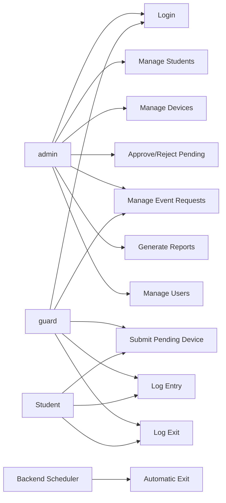

# 04 - Use Cases

## Actors

| Actor | Role |
| --- | --- |
| Admin | User with stored role `admin`; manages records, approvals, reports, users, and audit review. |
| Guard | User with stored role `guard`; performs gate search, pending submission, event request support, and entry/exit logging. |
| Student | Indirect actor who provides information and presents devices. |
| Backend Scheduler | System process that creates automatic exit records at school closing. |

## Use Case Overview

## UC-001 Login

| Item | Description |
| --- | --- |
| Actor | Admin, Guard |
| Goal | Access allowed system functions. |
| Preconditions | Active account exists in `users`. |
| Basic Flow | User submits username/password; backend verifies hash and status; backend returns session/token data with role; frontend opens the matching dashboard. |
| Exceptions | Invalid credentials; inactive account; backend unavailable; database unavailable. |
| Postconditions | Session starts and audit event is recorded. |

## UC-002 Manage Student

| Item | Description |
| --- | --- |
| Actor | Admin |
| Goal | Maintain student registry records. |
| Preconditions | Admin is authenticated. |
| Basic Flow | Admin enters student ID, first name, last name, course/year level, and status; backend validates; DAO writes `students`; audit is recorded. |
| Alternatives | Admin updates or deactivates an existing student. |
| Exceptions | Duplicate student ID; missing required names; hard delete blocked by linked records. |
| Postconditions | Student is available for device ownership and search. |

## UC-003 Register Or Manage BYOD Device

| Item | Description |
| --- | --- |
| Actor | Admin |
| Goal | Maintain permanent BYOD device records. |
| Preconditions | Student exists. |
| Basic Flow | Admin enters owner, device details, serial number, type, purpose, status, remarks, and optional image path; backend validates constraints; device is saved. |
| Alternatives | Admin approves, rejects, updates, activates, or deactivates a device. |
| Exceptions | Duplicate serial number; invalid enum value; rejection without remarks; invalid registration transition. |
| Postconditions | Approved active devices can be used for gate logging. |

## UC-004 Submit Pending Device Registration

| Item | Description |
| --- | --- |
| Actor | Guard |
| Goal | Submit an unregistered device for admin review. |
| Preconditions | Guard is authenticated and has manually verified the student/device details. |
| Basic Flow | Guard enters student and device details; backend creates or links the student; backend inserts `devices` with `registration_status = 'pending'`; audit is recorded. |
| Exceptions | Duplicate serial number; missing required student/device details. |
| Postconditions | Pending device appears in `v_pending_devices` for admin review. |

## UC-005 Approve Pending Device

| Item | Description |
| --- | --- |
| Actor | Admin |
| Goal | Make a pending device eligible for monitoring. |
| Preconditions | Pending device exists. |
| Basic Flow | Admin reviews details; approves; backend sets `registration_status = 'approved'`, `reviewed_by`, and `reviewed_at`; audit is recorded. |
| Exceptions | Missing owner; invalid state transition; database failure. |
| Postconditions | Approved active device can receive `device_logs` rows. |

## UC-006 Reject Pending Device

| Item | Description |
| --- | --- |
| Actor | Admin |
| Goal | Reject an invalid pending device. |
| Preconditions | Pending device exists. |
| Basic Flow | Admin enters rejection remarks; backend sets `registration_status = 'rejected'`, reviewer fields, and remarks; audit is recorded. |
| Exceptions | Missing rejection remarks. |
| Postconditions | Rejected device cannot receive gate logs. |

## UC-007 Manage Event Request

| Item | Description |
| --- | --- |
| Actor | Admin, Guard |
| Goal | Record event-based temporary access requests. |
| Preconditions | Responsible student/person, event details, and approval document details are available. |
| Basic Flow | User creates `event_requests` header and adds `event_request_devices` rows; backend validates document type, dates, and line-item quantities. |
| Alternatives | Admin approves, rejects, or marks returned; guard verifies device line items when applicable. |
| Exceptions | Missing event name; invalid document type; end date before start date; missing device line item before approval. |
| Postconditions | Event request appears in event request queues and reports. |

## UC-008 Log Device Entry

| Item | Description |
| --- | --- |
| Actor | Guard, Admin |
| Goal | Record campus entry for an approved active device. |
| Preconditions | Device exists, is approved, active, and currently outside based on latest log. |
| Basic Flow | User searches; backend returns device and derived status; user confirms; backend inserts `device_logs` entry row and audit event. |
| Exceptions | Device not found; pending/rejected/inactive device; consecutive entry blocked. |
| Postconditions | Latest event shows the device inside. |

## UC-009 Log Device Exit

| Item | Description |
| --- | --- |
| Actor | Guard, Admin |
| Goal | Record campus exit for an approved active device. |
| Preconditions | Device latest event is entry. |
| Basic Flow | User searches active device; confirms exit; backend inserts `device_logs` exit row with manual logout type and audit event. |
| Exceptions | Device not found; no active entry; consecutive exit blocked. |
| Postconditions | Latest event shows the device outside. |

## UC-010 Automatic Logout

| Item | Description |
| --- | --- |
| Actor | Backend Scheduler |
| Goal | Reconcile devices still inside at school closing. |
| Preconditions | Scheduled job is enabled. |
| Basic Flow | Scheduler finds devices whose latest log is entry; backend inserts automatic exit rows; audit summary is recorded. |
| Exceptions | Database unavailable; trigger failure; partial batch rollback. |
| Postconditions | Affected devices derive outside status from latest exit row. |

## UC-011 Generate Reports

| Item | Description |
| --- | --- |
| Actor | Admin |
| Goal | Produce monitoring and administrative reports. |
| Preconditions | Admin is authenticated. |
| Basic Flow | Admin selects report type and filters; backend queries saved tables/views; frontend displays results. |
| Exceptions | Invalid date range; no records found; backend unavailable. |
| Postconditions | Report data is displayed without changing records. |

## UC-012 Manage Users

| Item | Description |
| --- | --- |
| Actor | Admin |
| Goal | Maintain admin and guard accounts. |
| Preconditions | Admin is authenticated. |
| Basic Flow | Admin creates or updates username, full name, role, status, and password hash; backend validates uniqueness and role values; audit is recorded. |
| Exceptions | Duplicate username; invalid role; inactive account cannot log in. |
| Postconditions | User account state is updated. |
