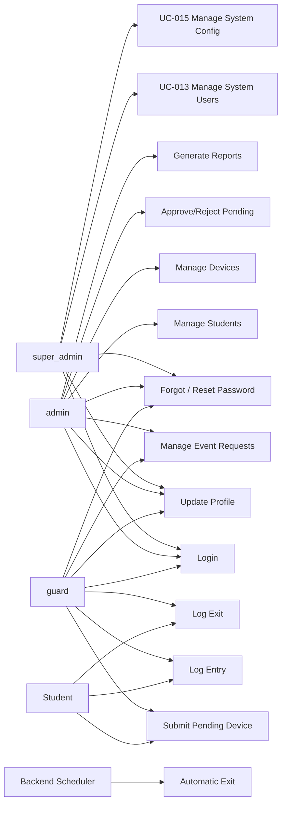

# 04 - Use Cases

## Actors

| Actor | Role |
| --- | --- |
| Super Admin | User with stored role super_admin; manages all user accounts, assigns roles, configures system settings. |
| Admin | User with stored role admin; manages records, approvals, reports, and reviews audit history. |
| Guard | User with stored role guard; performs gate search, pending submission, event request support, and entry/exit logging. |
| Student | Indirect actor who provides information and presents devices at the gate. |
| Backend Scheduler | System process that creates automatic exit records at school closing. |

## Use Case Overview

## UC-001 Login

| Item | Description |
| --- | --- |
| Actor | Super Admin, Admin, Guard |
| Goal | Access allowed system functions. |
| Preconditions | Active account (status = 'active') exists in users. |
| Basic Flow | User submits username/password; backend verifies hash and status; backend returns session/token data with role; frontend opens the matching dashboard (Super Admin, Admin, or Guard). |
| Exceptions | Invalid credentials; inactive account (status = 'inactive'); pending account (status = 'pending'); backend unavailable; database unavailable. |
| Postconditions | Session starts and USER_LOGIN audit event is recorded. |

## UC-002 Update Profile

| Item | Description |
| --- | --- |
| Actor | Super Admin, Admin, Guard |
| Goal | Update own username or password. |
| Preconditions | User is authenticated. |
| Basic Flow - Username | User enters a new username (min 3 characters); backend validates uniqueness; username is updated. |
| Basic Flow - Password | User enters current password, new password, and confirmation; backend verifies current password; new hash is stored. |
| Exceptions | Username too short; duplicate username; current password mismatch; new password/confirm mismatch. |
| Postconditions | Updated credentials are active on next login attempt. |

## UC-003 Forgot / Reset Password

| Item | Description |
| --- | --- |
| Actor | Super Admin, Admin, Guard |
| Goal | Recover access to a locked or forgotten account. |
| Preconditions | Account exists. |
| Basic Flow | User initiates forgot-password flow; system generates a reset token or route; user submits new password on reset screen; backend stores new hash. |
| Exceptions | Invalid reset token; expired token; new password too weak. |
| Postconditions | Account password is updated; USER_UPDATED audit event is recorded. |

## UC-004 Manage Student

| Item | Description |
| --- | --- |
| Actor | Admin |
| Goal | Maintain student registry records. |
| Preconditions | Admin is authenticated. |
| Basic Flow | Admin enters student ID, first name, last name, course/year level, and status; backend validates; DAO writes students; STUDENT_CREATED audit is recorded. |
| Alternatives | Admin updates (STUDENT_UPDATED) or deactivates (STUDENT_DEACTIVATED) an existing student. |
| Exceptions | Duplicate student ID; missing required names; hard delete blocked by linked records. |
| Postconditions | Student is available for device ownership and search. |

## UC-005 Register Or Manage BYOD Device

| Item | Description |
| --- | --- |
| Actor | Admin |
| Goal | Maintain permanent BYOD device records. |
| Preconditions | Student exists. |
| Basic Flow | Admin selects the student owner, enters device name, brand, model, serial number, device category, purpose, status, and remarks; backend validates constraints (including max_devices_per_student system setting); device is saved with DEVICE_REGISTERED audit. |
| Alternatives | Admin approves, rejects, updates, activates, or deactivates a device. |
| Exceptions | Duplicate serial number; invalid category or purpose value; rejection without remarks; invalid registration transition; max devices exceeded. |
| Postconditions | Approved active devices can be logged; active pending devices may be checked in when allow_unregistered_devices permits it. |

## UC-006 Submit Pending Device Registration

| Item | Description |
| --- | --- |
| Actor | Guard |
| Goal | Submit an unregistered device for admin review. |
| Preconditions | Guard is authenticated and has the required globally unique permanent-device serial number. |
| Basic Flow | Guard enters student and device details; backend creates or links the student; backend inserts devices with registration_status = 'pending'; proof details stored in devices.remarks; DEVICE_REGISTERED audit is recorded. |
| Exceptions | Duplicate serial number; missing required student/device details. |
| Postconditions | Pending device appears in v_pending_devices and may be checked in while active when allow_unregistered_devices is true. |

## UC-007 Approve Pending Device

| Item | Description |
| --- | --- |
| Actor | Admin |
| Goal | Make a pending device eligible for monitoring. |
| Preconditions | Pending device exists in v_pending_devices. |
| Basic Flow | Admin reviews details; approves; backend sets registration_status = 'approved', reviewed_by, and reviewed_at; DEVICE_APPROVED audit is recorded. |
| Exceptions | Missing owner; invalid state transition; database failure. |
| Postconditions | Approved active device can receive device_logs rows. |

## UC-008 Reject Pending Device

| Item | Description |
| --- | --- |
| Actor | Admin |
| Goal | Reject an invalid pending device. |
| Preconditions | Pending device exists. |
| Basic Flow | Admin enters rejection remarks; backend sets registration_status = 'rejected', reviewer fields, and remarks; DEVICE_REJECTED audit is recorded. |
| Exceptions | Missing rejection remarks. |
| Postconditions | Rejected device cannot receive gate logs. |

## UC-009 Manage Event Request

| Item | Description |
| --- | --- |
| Actor | Admin or another authorized submitter; Admin reviewer; Guard scanner; Guard or Admin reconciler |
| Goal | Create, review, scan, and reconcile temporary event device requests. |
| Preconditions | Responsible student/person, event details, and approval document details are available. |
| Basic Flow | An admin or other authorized submitter creates a header and manifest rows with quantity > 0; backend validates the document and configured maximum duration; normal API submission auto-approves the request and child devices. During active dates, Guard logs entry/exit in event_device_logs. |
| Alternatives | A manually queued request is approved, returned with remarks, or rejected with remarks by Admin. A returned request is corrected and resubmitted to PendingApproval, persisted as status = 'pending'. Guard or Admin manually reconciles a device by setting manifest status to returned. |
| Exceptions | Missing event name; invalid document type; invalid or over-limit date range; non-positive quantity; scan outside active dates; duplicate entry/exit; unauthorized review action. |
| Postconditions | Request and manifest status are available through v_active_event_requests and v_event_device_status; reconciliation reporting identifies outstanding items. |

## UC-010 Log Device Entry

| Item | Description |
| --- | --- |
| Actor | Guard, Admin |
| Goal | Record campus entry for an approved active device. |
| Preconditions | Device exists, is active, is approved or policy-eligible pending, and is currently outside based on latest log. |
| Basic Flow | User searches; backend returns device and derived status from v_device_campus_status; user confirms; backend inserts device_logs entry row and DEVICE_ENTRY audit event. |
| Exceptions | Device not found; pending device disallowed by policy; rejected/inactive device; consecutive entry blocked by trigger. |
| Postconditions | Latest event shows the device inside campus. |

## UC-011 Log Device Exit

| Item | Description |
| --- | --- |
| Actor | Guard, Admin |
| Goal | Record campus exit for an approved active device. |
| Preconditions | Device latest event is entry. |
| Basic Flow | User searches active device; confirms exit; backend inserts device_logs exit row with logout_type = 'manual'; DEVICE_EXIT audit event is recorded. |
| Exceptions | Device not found; no active entry; consecutive exit blocked by trigger. |
| Postconditions | Latest event shows the device outside campus. |

## UC-012 Automatic Logout

| Item | Description |
| --- | --- |
| Actor | Backend Scheduler |
| Goal | Reconcile devices still inside campus at school closing. |
| Preconditions | Scheduled job is enabled. |
| Basic Flow | Scheduler finds devices whose latest log is entry; backend inserts automatic exit rows with auto_exit = TRUE, logout_type = 'automatic', handled_by = NULL; SYSTEM_AUTO_EXIT_BATCH audit summary is recorded. |
| Exceptions | Database unavailable; trigger failure; partial batch rollback. |
| Postconditions | Affected devices derive outside status from latest exit row. |

## UC-013 Manage System Users

| Item | Description |
| --- | --- |
| Actor | Super Admin |
| Goal | Maintain admin and guard user accounts. |
| Preconditions | Super Admin is authenticated. |
| Basic Flow - Onboard | Super Admin enters full name, email, and role; backend creates account with status = 'pending'; onboarding email or credential delivery is initiated; ADMIN_CREATED or GUARD_CREATED audit is recorded. |
| Basic Flow - Update | Super Admin updates full name or status; ADMIN_UPDATED or GUARD_UPDATED audit is recorded. |
| Basic Flow - Change Role | Super Admin selects a new role for an existing account; USER_ROLE_CHANGED audit is recorded. |
| Basic Flow - Deactivate | Super Admin deactivates an account setting status = 'inactive'; ADMIN_DEACTIVATED or GUARD_DEACTIVATED_BY_SUPER audit is recorded. |
| Exceptions | Duplicate username/email; invalid role; self-deactivation blocked. |
| Postconditions | Account state updated; affected user must re-login if deactivated. |

## UC-014 Generate Reports

| Item | Description |
| --- | --- |
| Actor | Admin |
| Goal | Produce monitoring and administrative reports. |
| Preconditions | Admin is authenticated. |
| Basic Flow | Admin selects report type and filters; backend queries saved tables/views; frontend displays results and supports export or print. |
| Report Types | Daily Device Traffic Summary, Monthly Device Traffic Summary, Pending Registration Report, Active Devices on Campus, Device Frequency Report, Incident/Override Report, Event Device Reconciliation Report. |
| Exceptions | Invalid date range; no records found; backend unavailable. |
| Postconditions | Report data is displayed without changing records. |

## UC-015 Manage System Configuration

| Item | Description |
| --- | --- |
| Actor | Super Admin |
| Goal | Update configurable system policy settings. |
| Preconditions | Super Admin is authenticated. |
| Basic Flow | Super Admin opens System Configuration screen; selects a setting from the table; edits the value; saves; backend updates system_settings; SYSTEM_CONFIG_UPDATED audit is recorded. |
| Configurable Settings | max_devices_per_student (default 5); allow_unregistered_devices (default true); event_request_max_duration_days (default 7); auto_exit_cutoff_time (default 22:00). |
| Exceptions | Empty value submitted; backend unavailable. |
| Postconditions | Updated setting is immediately applied to subsequent backend operations. |
