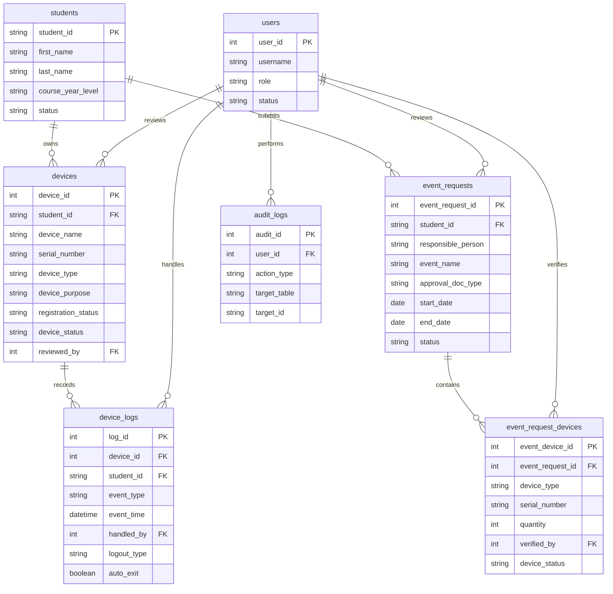

# 06 - Data Requirements And Data Dictionary

## Source Of Truth

This document summarizes the uploaded PostgreSQL schema for system analysis and traceability.

## Database Objects

| Object | Purpose |
| --- | --- |
| `users` | Admin and guard accounts. No student logins. |
| `students` | Student registry records. |
| `devices` | Permanent BYOD device registrations and pending device submissions. |
| `event_requests` | Header records for event-based temporary access requests. |
| `event_request_devices` | Device line items under an event request. |
| `device_logs` | Immutable gate entry/exit event rows. |
| `audit_logs` | Immutable system-wide audit trail. |
| `v_device_campus_status` | Derived inside/outside status for approved active devices. |
| `v_pending_devices` | Admin pending-device approval queue. |
| `v_active_event_requests` | Pending/approved event requests with device counts. |

## Status And Enum Values

| Field | Allowed Values |
| --- | --- |
| `users.role` | `admin`, `guard` |
| `users.status`, `students.status`, `devices.device_status` | `active`, `inactive` |
| `devices.device_type` | `laptop`, `tablet`, `phone` |
| `devices.device_purpose` | `Academic BYOD`, `School Event`, `Organization Activity`, `Temporary Equipment`, `Other Approved Purpose` |
| `devices.registration_status` | `pending`, `approved`, `rejected` |
| `event_requests.approval_doc_type` | `Paper Approval`, `Signed GPOA` |
| `event_requests.status` | `pending`, `approved`, `returned`, `rejected` |
| `event_request_devices.device_type` | `laptop`, `tablet`, `phone`, `camera`, `projector`, `other` |
| `event_request_devices.device_status` | `pending`, `approved`, `returned` |
| `device_logs.event_type` | `entry`, `exit` |
| `device_logs.logout_type` | `manual`, `automatic` |

## Table: `users`

| Column | Type | Required | Key/Constraint | Notes |
| --- | --- | --- | --- | --- |
| `user_id` | SERIAL | Yes | PK | Account identifier. |
| `username` | VARCHAR(100) | Yes | Unique, min length 3 | Login name. |
| `password_hash` | TEXT | Yes | Min length 20 | bcrypt or argon2 hash only. |
| `full_name` | VARCHAR(255) | No |  | Display name. |
| `role` | VARCHAR(10) | Yes | `admin`, `guard` | Access control role. |
| `status` | VARCHAR(10) | Yes | `active`, `inactive` | Inactive users cannot log in. |
| `created_at` | TIMESTAMPTZ | Yes | Default current timestamp | Server timestamp. |
| `updated_at` | TIMESTAMPTZ | Yes | Trigger-maintained | Updated on every update. |

## Table: `students`

| Column | Type | Required | Key/Constraint | Notes |
| --- | --- | --- | --- | --- |
| `student_id` | VARCHAR(50) | Yes | PK, non-blank | School student number. |
| `first_name` | VARCHAR(100) | Yes | Non-blank | Student first name. |
| `last_name` | VARCHAR(100) | Yes | Non-blank | Student last name. |
| `course_year_level` | VARCHAR(100) | No |  | Course/year display value. |
| `status` | VARCHAR(10) | Yes | `active`, `inactive` | Deactivation flag. |
| `created_at` | TIMESTAMPTZ | Yes | Default current timestamp | Server timestamp. |
| `updated_at` | TIMESTAMPTZ | Yes | Trigger-maintained | Updated on every update. |

## Table: `devices`

| Column | Type | Required | Key/Constraint | Notes |
| --- | --- | --- | --- | --- |
| `device_id` | SERIAL | Yes | PK | Device identifier. |
| `student_id` | VARCHAR(50) | Yes | FK to `students` | Permanent device owner. |
| `device_name` | VARCHAR(255) | No |  | Friendly name. |
| `brand` | VARCHAR(100) | No |  | Manufacturer. |
| `model` | VARCHAR(100) | No |  | Model name. |
| `serial_number` | VARCHAR(255) | Yes | Unique | Required global identifier. |
| `device_type` | VARCHAR(10) | No | Check constraint | BYOD type. |
| `device_purpose` | VARCHAR(100) | No | Check constraint | Purpose category. |
| `registration_status` | VARCHAR(10) | Yes | Check constraint | Pending, approved, or rejected. |
| `device_status` | VARCHAR(10) | Yes | Check constraint | Active or inactive. |
| `reviewed_by` | INT | No | FK to `users` | Admin reviewer. |
| `reviewed_at` | TIMESTAMPTZ | No | Paired with reviewer | Review timestamp. |
| `remarks` | TEXT | No | Required when rejected | Notes/rejection reason/proof detail. |
| `image_path` | VARCHAR(500) | No |  | Device image path. |
| `created_at` | TIMESTAMPTZ | Yes | Default current timestamp | Server timestamp. |
| `updated_at` | TIMESTAMPTZ | Yes | Trigger-maintained | Updated on every update. |

## Table: `event_requests`

| Column | Type | Required | Key/Constraint | Notes |
| --- | --- | --- | --- | --- |
| `event_request_id` | SERIAL | Yes | PK | Request identifier. |
| `student_id` | VARCHAR(50) | Yes | FK to `students` | Responsible/submitting student. |
| `responsible_person` | VARCHAR(255) | No |  | Person in charge. |
| `organization` | VARCHAR(255) | No |  | Group or department. |
| `event_name` | VARCHAR(255) | Yes | Non-blank | Event name. |
| `event_purpose` | VARCHAR(255) | No |  | Purpose text. |
| `approval_doc_type` | VARCHAR(20) | No | Check constraint | Paper approval or signed GPOA. |
| `approval_doc_ref` | VARCHAR(255) | No |  | Document reference. |
| `start_date` | DATE | No | Date range rule | Event start. |
| `end_date` | DATE | No | Date range rule | Event end. |
| `status` | VARCHAR(10) | Yes | Check constraint | Request workflow state. |
| `is_submitted` | BOOLEAN | Yes | Default false | Physical form submission flag. |
| `is_accommodated` | BOOLEAN | Yes | Default false | Gate accommodation flag. |
| `reviewed_by` | INT | No | FK to `users` | Admin reviewer. |
| `reviewed_at` | TIMESTAMPTZ | No | Paired with reviewer | Review timestamp. |
| `remarks` | TEXT | No |  | Admin notes. |
| `created_at` | TIMESTAMPTZ | Yes | Default current timestamp | Server timestamp. |
| `updated_at` | TIMESTAMPTZ | Yes | Trigger-maintained | Updated on every update. |

## Table: `event_request_devices`

| Column | Type | Required | Key/Constraint | Notes |
| --- | --- | --- | --- | --- |
| `event_device_id` | SERIAL | Yes | PK | Line-item identifier. |
| `event_request_id` | INT | Yes | FK to `event_requests`, cascade delete | Parent request. |
| `device_name` | VARCHAR(255) | No |  | Device label. |
| `brand` | VARCHAR(100) | No |  | Brand. |
| `model` | VARCHAR(100) | No |  | Model. |
| `device_type` | VARCHAR(20) | No | Check constraint | Event device type. |
| `serial_number` | VARCHAR(255) | No | Unique with request when provided | May be null. |
| `quantity` | INT | Yes | Greater than zero | Defaults to 1. |
| `verified_by` | INT | No | FK to `users` | Guard verifier. |
| `verified_at` | TIMESTAMPTZ | No |  | Verification timestamp. |
| `device_status` | VARCHAR(10) | Yes | Check constraint | Line-item status. |
| `remarks` | TEXT | No |  | Notes. |
| `created_at` | TIMESTAMPTZ | Yes | Default current timestamp | Server timestamp. |
| `updated_at` | TIMESTAMPTZ | Yes | Trigger-maintained | Updated on every update. |

## Table: `device_logs`

| Column | Type | Required | Key/Constraint | Notes |
| --- | --- | --- | --- | --- |
| `log_id` | SERIAL | Yes | PK | Log identifier. |
| `device_id` | INT | Yes | FK to `devices` | Logged permanent BYOD device. |
| `student_id` | VARCHAR(50) | Yes | FK to `students` | Device owner at log time. |
| `event_type` | VARCHAR(10) | Yes | `entry`, `exit` | One row per event. |
| `event_time` | TIMESTAMPTZ | Yes | Default current timestamp | Event timestamp. |
| `handled_by` | INT | Conditional | FK to `users` | Null only for automatic exits. |
| `logout_type` | VARCHAR(10) | No | `manual`, `automatic` | Exit classification. |
| `auto_exit` | BOOLEAN | Yes | Default false | System-generated exit flag. |
| `notes` | TEXT | No |  | Guard/system notes. |
| `created_at` | TIMESTAMPTZ | Yes | Forced by trigger | Cannot be backdated. |

## Table: `audit_logs`

| Column | Type | Required | Key/Constraint | Notes |
| --- | --- | --- | --- | --- |
| `audit_id` | SERIAL | Yes | PK | Audit identifier. |
| `user_id` | INT | No | FK to `users`, set null on user delete | Actor when applicable. |
| `action_type` | VARCHAR(100) | Yes | Check constraint | Standard action vocabulary. |
| `target_table` | VARCHAR(100) | Yes | Non-blank | Affected table. |
| `target_id` | VARCHAR(100) | No |  | Affected record key. |
| `old_values` | JSONB | No |  | Before state. |
| `new_values` | JSONB | No |  | After state. |
| `ip_address` | VARCHAR(45) | No | Length check | Client/backend IP if available. |
| `created_at` | TIMESTAMPTZ | Yes | Forced by trigger | Cannot be backdated. |

## ERD

