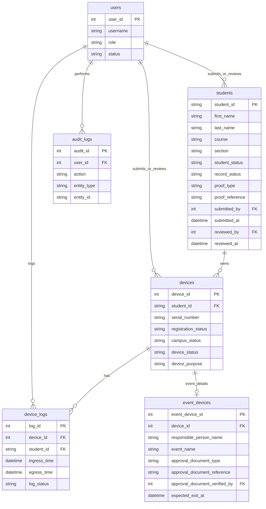

# 06 - Data Requirements and Data Dictionary

## Status Fields

| Field | Allowed Values | Meaning |
| --- | --- | --- |
| `registration_status` | Pending, Approved, Rejected | Approval state of device/student registration. |
| `campus_status` | Inside, Outside | Current physical monitoring state of the device. |
| `device_status` | Active, Inactive | Operational availability of the device record. |
| `device_purpose` | Academic BYOD, School Event, Organization Activity, Temporary Equipment, Other Approved Purpose | Reason the device/equipment is being brought to campus. |

## Table: students

| Field | Description | Suggested Type | Required | Constraints | Notes |
| --- | --- | --- | --- | --- | --- |
| student_id | Official student number | VARCHAR(30) | Yes | Primary key, unique | Use school student ID. |
| first_name | Student first name | VARCHAR(100) | Yes |  |  |
| last_name | Student last name | VARCHAR(100) | Yes |  |  |
| course | Course/program | VARCHAR(100) | Required for Official; optional for Pending |  | Guard enters this if available for pending student records. |
| section | Section/block | VARCHAR(50) | Required for Official; optional for Pending |  | Guard enters this if available for pending student records. |
| contact_number | Contact number | VARCHAR(30) | Optional |  | Format validation recommended. |
| email | Email address | VARCHAR(150) | Optional |  | Format validation recommended. |
| student_status | Active or Inactive | VARCHAR(20) | Yes | Default Active | Inactive students cannot receive new approved devices. |
| record_status | Official or Pending | VARCHAR(20) | Yes | Default Official | Pending supports guard-submitted student details. |
| proof_type | Proof used for pending student verification | VARCHAR(50) | Required for Pending | School ID, Registration Form, Enrollment Record, Other School-Approved Proof | Nullable for official records created directly by Admin. |
| proof_reference | Proof number, title, or remarks | VARCHAR(150) | Required for Pending |  | Example: school ID shown, enrollment form reference, or guard remarks. |
| submitted_by | User who submitted pending student | INTEGER | Required for Pending | FK to users | Guard who submitted the pending student record. |
| submitted_at | Pending student submission timestamp | DATETIME | Required for Pending | System generated |  |
| reviewed_by | Admin reviewer | INTEGER | Optional | FK to users | Used when pending student is approved as Official or rejected/deactivated. |
| reviewed_at | Review timestamp | DATETIME | Optional | System generated |  |
| review_remarks | Admin review notes | TEXT | Optional |  | Required when rejecting or deactivating invalid pending student details. |
| created_at | Creation timestamp | DATETIME | Yes | System generated |  |
| updated_at | Last update timestamp | DATETIME | Optional | System generated |  |

## Table: devices

| Field | Description | Suggested Type | Required | Constraints | Notes |
| --- | --- | --- | --- | --- | --- |
| device_id | Device identifier | INTEGER | Yes | Primary key, auto increment |  |
| student_id | Student owner | VARCHAR(30) | Optional | FK to students | Required for Academic BYOD. Nullable for pure event equipment if event table is used. |
| device_type | Laptop, Tablet, Camera, etc. | VARCHAR(50) | Yes |  | Avoid overly broad "Other" without remarks. |
| brand | Device brand | VARCHAR(100) | Required for BYOD |  |  |
| model | Device model | VARCHAR(100) | Optional |  |  |
| serial_number | Device serial number | VARCHAR(100) | Required for BYOD | Unique where applicable | Some event equipment may use asset tag instead. |
| asset_tag | School or event asset tag | VARCHAR(100) | Optional | Unique where applicable | Useful for event equipment. |
| color | Physical color | VARCHAR(50) | Optional |  |  |
| image_path | Local path to device image | VARCHAR(255) | Optional |  | Optional verification aid. |
| registration_status | Pending, Approved, Rejected | VARCHAR(20) | Yes |  | Separate from campus/device status. |
| campus_status | Inside, Outside | VARCHAR(20) | Yes | Default Outside | Current physical status. |
| device_status | Active, Inactive | VARCHAR(20) | Yes | Default Active | Operational status used to allow or prevent monitoring actions. |
| device_purpose | Device purpose | VARCHAR(50) | Yes |  | Academic BYOD or event purpose. |
| submitted_by | User who submitted record | INTEGER | Optional | FK to users | Required for pending records. |
| submitted_at | Submission timestamp | DATETIME | Optional |  | Required for pending records. |
| approved_by | Admin approver | INTEGER | Optional | FK to users | Required when approved from pending. |
| approved_at | Approval timestamp | DATETIME | Optional |  |  |
| rejected_by | Admin rejector | INTEGER | Optional | FK to users | Required when rejected. |
| rejected_at | Rejection timestamp | DATETIME | Optional |  |  |
| rejection_reason | Reason for rejection | TEXT | Optional |  | Required when rejected. |
| remarks | Notes | TEXT | Optional |  |  |

## Table: event_devices

Use this table when the implementation separates event details from the main device record.

| Field | Description | Suggested Type | Required | Constraints | Notes |
| --- | --- | --- | --- | --- | --- |
| event_device_id | Event device identifier | INTEGER | Yes | Primary key, auto increment |  |
| device_id | Linked device record | INTEGER | Yes | FK to devices |  |
| responsible_person_name | Person accountable for equipment | VARCHAR(150) | Yes |  | Could be student, faculty, staff, or organizer. |
| responsible_person_contact | Contact number/email | VARCHAR(150) | Optional |  |  |
| event_name | Event/activity name | VARCHAR(150) | Yes |  |  |
| organization_or_department | Group responsible | VARCHAR(150) | Optional |  |  |
| event_purpose | Purpose of equipment | VARCHAR(150) | Yes |  |  |
| approval_document_type | Paper Approval, Signed GPOA, Other Approved Document | VARCHAR(50) | Yes |  | Proof presented by organization/responsible person. |
| approval_document_reference | Document number, title, signer, or short description | VARCHAR(150) | Yes |  | Use a practical reference if no formal number exists. |
| approval_document_verified_by | Guard who checked the document | INTEGER | Yes | FK to users | Guard may accept event device entry at the gate. |
| approval_document_verified_at | Verification timestamp | DATETIME | Yes | System generated | Recorded when guard verifies document. |
| expected_exit_at | Expected exit/return time | DATETIME | Yes |  | Used for follow-up. |
| reviewed_by | Admin reviewer | INTEGER | Optional | FK to users | Optional post-entry review; not required before ingress. |
| remarks | Notes | TEXT | Optional |  |  |

## Table: device_logs

| Field | Description | Suggested Type | Required | Constraints | Notes |
| --- | --- | --- | --- | --- | --- |
| log_id | Log identifier | INTEGER | Yes | Primary key, auto increment |  |
| device_id | Logged device | INTEGER | Yes | FK to devices |  |
| student_id | Student owner if applicable | VARCHAR(30) | Optional | FK to students | Nullable for pure event equipment. |
| ingress_time | Entry timestamp | DATETIME | Yes | System generated |  |
| egress_time | Exit timestamp | DATETIME | Optional | Must be after ingress | Null means open ingress. |
| log_status | Inside or Exited | VARCHAR(20) | Yes |  | Derived from egress state where possible. |
| logged_in_by | User who logged ingress | INTEGER | Yes | FK to users |  |
| logged_out_by | User who logged egress | INTEGER | Optional | FK to users |  |
| auto_logged_out | Whether egress was automatic at school closing | BOOLEAN | Yes | Default false | True for school-closing auto logout. |
| entry_type | Approved, Pending Temporary, Event | VARCHAR(30) | Yes |  | Helps reports. |
| remarks | Notes | TEXT | Optional |  |  |
| correction_reason | Correction note | TEXT | Optional |  | Admin-only correction note. |

## Table: users

| Field | Description | Suggested Type | Required | Constraints | Notes |
| --- | --- | --- | --- | --- | --- |
| user_id | User identifier | INTEGER | Yes | Primary key, auto increment |  |
| username | Login username | VARCHAR(100) | Yes | Unique |  |
| password_hash | Hashed password | VARCHAR(255) | Yes |  | Never store plain text. |
| full_name | User full name | VARCHAR(150) | Yes |  |  |
| role | Admin or Security Guard | VARCHAR(30) | Yes |  |  |
| status | Active or Inactive | VARCHAR(20) | Yes | Default Active |  |
| created_at | Creation timestamp | DATETIME | Yes | System generated |  |
| updated_at | Last update timestamp | DATETIME | Optional | System generated |  |

## Table: audit_logs

| Field | Description | Suggested Type | Required | Constraints | Notes |
| --- | --- | --- | --- | --- | --- |
| audit_id | Audit identifier | INTEGER | Yes | Primary key, auto increment |  |
| user_id | User who performed action | INTEGER | Yes | FK to users |  |
| action | Action name | VARCHAR(100) | Yes |  | Example: SUBMIT_PENDING_STUDENT, APPROVE_PENDING, REJECT_PENDING, REACTIVATE_DEVICE. |
| entity_type | Affected entity/table | VARCHAR(50) | Yes |  |  |
| entity_id | Affected record ID | VARCHAR(100) | Yes |  | String supports different key types. |
| old_value | Previous value | TEXT | Optional |  |  |
| new_value | New value | TEXT | Optional |  |  |
| remarks | Reason or notes | TEXT | Optional |  | Required for sensitive changes. |
| created_at | Audit timestamp | DATETIME | Yes | System generated |  |

## Draft ERD

