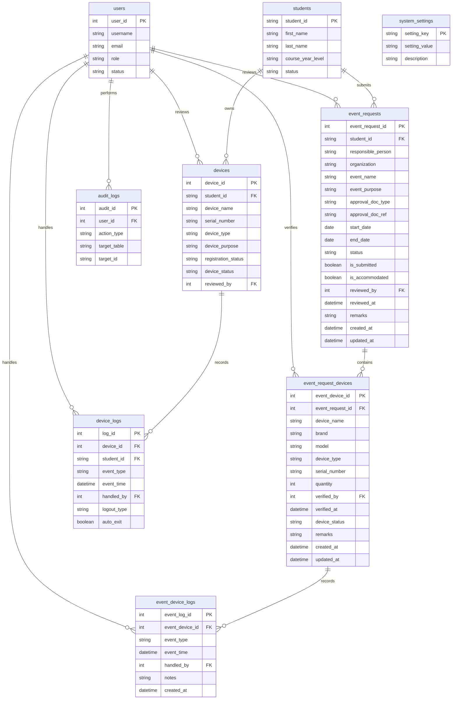

# 06 - Data Requirements And Data Dictionary

## Source Of Truth

This document summarizes the final PostgreSQL schema supplied on June 15, 2026. That SQL is authoritative for the system data layer.

## Database Objects

| Object | Purpose |
| --- | --- |
| users | Super Admin, Admin, and Guard accounts. No student logins. |
| students | Student registry records. |
| devices | Permanent BYOD device registrations and pending device submissions. |
| event_requests | Header records for event-based temporary access requests. |
| event_request_devices | Device line items under an event request. |
| device_logs | Immutable gate entry/exit event rows. |
| event_device_logs | Immutable entry/exit rows for temporary event manifest devices. |
| audit_logs | Immutable system-wide audit trail. |
| system_settings | Configurable system policy parameters managed by Super Admin. |
| v_device_campus_status | Derived inside/outside status for active approved or pending permanent devices. |
| v_event_device_status | Derived current-day entry/exit status for event manifest devices. |
| v_pending_devices | Admin pending-device approval queue. |
| v_active_event_requests | Pending/approved event requests with device counts. |

## Status And Enum Values

| Field | Allowed Values |
| --- | --- |
| users.role | super_admin, admin, guard |
| users.status | active, inactive, pending |
| students.status, devices.device_status | active, inactive |
| devices.device_type | Personal Computers, Components & Peripherals, Display & Projection, Project Prototypes (Optional SN), Appliances (TLE) |
| devices.device_purpose | Academic BYOD, School Event, Organization Activity, Temporary Equipment, Other Approved Purpose, PROTOTYPE, APPLIANCE |
| devices.registration_status | pending, approved, rejected |
| event_requests.approval_doc_type | Paper Approval, Signed GPOA |
| event_requests.status | pending, approved, returned, rejected |
| event_request_devices.device_type | Personal Computers, Components & Peripherals, Display & Projection, Project Prototypes (Optional SN), Appliances (TLE), Other |
| event_request_devices.device_status | pending, approved, returned |
| device_logs.event_type | entry, exit |
| device_logs.logout_type | manual, automatic |
| event_device_logs.event_type | entry, exit |

## Table: users

| Column | Type | Required | Key/Constraint | Notes |
| --- | --- | --- | --- | --- |
| user_id | SERIAL | Yes | PK | Account identifier. |
| username | VARCHAR(100) | Yes | Unique, min length 3 | Login name. |
| email | VARCHAR(255) | No | Unique | User email; required by the onboarding workflow even though the database column is nullable. |
| password_hash | TEXT | Yes | Min length 20 | bcrypt or argon2 hash only. Never plaintext. |
| full_name | VARCHAR(255) | No | - | Display name. |
| role | VARCHAR(20) | Yes | super_admin, admin, guard | Access control role. |
| status | VARCHAR(10) | Yes | active, inactive, pending | Inactive/pending accounts cannot log in. |
| created_at | TIMESTAMPTZ | Yes | Default current timestamp | Server timestamp. |
| updated_at | TIMESTAMPTZ | Yes | Trigger-maintained | Updated on every UPDATE. |
| password_reset_token | VARCHAR(255) | No | Unique | Password recovery token. |
| password_reset_expires_at | TIMESTAMPTZ | No | - | Token expiry timestamp. |

## Table: students

| Column | Type | Required | Key/Constraint | Notes |
| --- | --- | --- | --- | --- |
| student_id | VARCHAR(50) | Yes | PK, non-blank | School student number. |
| first_name | VARCHAR(100) | Yes | Non-blank | Student first name. |
| last_name | VARCHAR(100) | Yes | Non-blank | Student last name. |
| course_year_level | VARCHAR(100) | No | - | Course/year display value. |
| status | VARCHAR(10) | Yes | active, inactive | Deactivation flag. |
| created_at | TIMESTAMPTZ | Yes | Default current timestamp | Server timestamp. |
| updated_at | TIMESTAMPTZ | Yes | Trigger-maintained | Updated on every UPDATE. |

## Table: devices

| Column | Type | Required | Key/Constraint | Notes |
| --- | --- | --- | --- | --- |
| device_id | SERIAL | Yes | PK | Device identifier. |
| student_id | VARCHAR(50) | Yes | FK to students | Permanent device owner. |
| device_name | VARCHAR(255) | No | - | Friendly name. |
| brand | VARCHAR(100) | No | - | Manufacturer. |
| model | VARCHAR(100) | No | - | Model name. |
| serial_number | VARCHAR(255) | Yes | Unique | Required and globally unique for every permanent device. |
| device_type | VARCHAR(50) | No | Check constraint | Device category (see enum table). |
| device_purpose | VARCHAR(100) | No | Check constraint | Purpose category (see enum table). |
| registration_status | VARCHAR(10) | Yes | Check constraint | Pending, approved, or rejected. |
| device_status | VARCHAR(10) | Yes | Check constraint | Active or inactive. |
| reviewed_by | INT | No | FK to users | Admin reviewer. |
| reviewed_at | TIMESTAMPTZ | No | Paired with reviewer | Review timestamp. |
| remarks | TEXT | No | Required when rejected | Notes/rejection reason/proof detail. |
| image_path | VARCHAR(500) | No | - | Optional path retained by the final schema and exposed through v_pending_devices. The authoritative sources do not define its application workflow. |
| created_at | TIMESTAMPTZ | Yes | Default current timestamp | Server timestamp. |
| updated_at | TIMESTAMPTZ | Yes | Trigger-maintained | Updated on every UPDATE. |

## Table: event_requests

| Column | Type | Required | Key/Constraint | Notes |
| --- | --- | --- | --- | --- |
| event_request_id | SERIAL | Yes | PK | Request identifier. |
| student_id | VARCHAR(50) | Yes | FK to students | Responsible/submitting student. |
| responsible_person | VARCHAR(255) | No | - | Person in charge. |
| organization | VARCHAR(255) | No | - | Group or department. |
| event_name | VARCHAR(255) | Yes | Non-blank | Event name. |
| event_purpose | VARCHAR(255) | No | - | Purpose text. |
| approval_doc_type | VARCHAR(20) | No | Check constraint | Paper Approval or Signed GPOA. |
| approval_doc_ref | VARCHAR(255) | No | - | Document reference. |
| start_date | DATE | No | Date range rule | Event start. |
| end_date | DATE | No | Date range rule | Event end; must be >= start_date when both provided. |
| status | VARCHAR(10) | Yes | Check constraint, default pending | Database state. Workflow PendingApproval is persisted as pending; normal API submissions are changed to approved by the service. |
| is_submitted | BOOLEAN | Yes | Default false | Physical form submission flag. |
| is_accommodated | BOOLEAN | Yes | Default false | Gate accommodation flag. |
| reviewed_by | INT | No | FK to users | Admin reviewer. |
| reviewed_at | TIMESTAMPTZ | No | Paired with reviewer | Review timestamp. |
| remarks | TEXT | No | - | Review notes. The workflow requires return and rejection reasons here; the database does not enforce that requirement. |
| created_at | TIMESTAMPTZ | Yes | Default current timestamp | Server timestamp. |
| updated_at | TIMESTAMPTZ | Yes | Trigger-maintained | Updated on every UPDATE. |

## Table: event_request_devices

| Column | Type | Required | Key/Constraint | Notes |
| --- | --- | --- | --- | --- |
| event_device_id | SERIAL | Yes | PK | Line-item identifier. |
| event_request_id | INT | Yes | FK to event_requests, cascade delete | Parent request. |
| device_name | VARCHAR(255) | No | - | Device label. |
| brand | VARCHAR(100) | No | - | Brand. |
| model | VARCHAR(100) | No | - | Model. |
| device_type | VARCHAR(50) | No | Check constraint | Event device category. |
| serial_number | VARCHAR(255) | No | Unique with request when provided | May be null. |
| quantity | INT | Yes | Greater than zero | Defaults to 1. The final schema permits any positive quantity. |
| verified_by | INT | No | FK to users | Guard verifier. |
| verified_at | TIMESTAMPTZ | No | - | Verification timestamp. |
| device_status | VARCHAR(10) | Yes | Check constraint, default pending | Line-item status; normal API auto-approval changes it to approved. |
| remarks | TEXT | No | - | Notes. |
| created_at | TIMESTAMPTZ | Yes | Default current timestamp | Server timestamp. |
| updated_at | TIMESTAMPTZ | Yes | Trigger-maintained | Updated on every UPDATE. |

## Table: device_logs

| Column | Type | Required | Key/Constraint | Notes |
| --- | --- | --- | --- | --- |
| log_id | SERIAL | Yes | PK | Log identifier. |
| device_id | INT | Yes | FK to devices | Logged permanent BYOD device. |
| student_id | VARCHAR(50) | Yes | FK to students | Device owner at log time. |
| event_type | VARCHAR(10) | Yes | entry, exit | One row per event. |
| event_time | TIMESTAMPTZ | Yes | Default current timestamp | Event timestamp. |
| handled_by | INT | Conditional | FK to users | Null only for automatic exits. |
| logout_type | VARCHAR(10) | No | manual, automatic | Exit classification. |
| auto_exit | BOOLEAN | Yes | Default false | System-generated exit flag. |
| notes | TEXT | No | - | Guard/system notes. |
| created_at | TIMESTAMPTZ | Yes | Forced by trigger | Cannot be backdated. |

## Table: event_device_logs

| Column | Type | Required | Key/Constraint | Notes |
| --- | --- | --- | --- | --- |
| event_log_id | SERIAL | Yes | PK | Event-device gate log identifier. |
| event_device_id | INT | Yes | FK to event_request_devices, cascade delete | Manifest device being scanned. |
| event_type | VARCHAR(10) | Yes | entry, exit | One immutable row per event. |
| event_time | TIMESTAMPTZ | Yes | Default current timestamp | Physical scan timestamp. |
| handled_by | INT | No | FK to users | Guard or Admin responsible for the event. |
| notes | TEXT | No | - | Gate or reconciliation context. |
| created_at | TIMESTAMPTZ | Yes | Forced by trigger | Server timestamp; cannot be backdated. |

The latest-event index is `(event_device_id, event_time DESC) INCLUDE (event_type)`. Database triggers reject consecutive same-type events, force `created_at`, and prevent UPDATE or DELETE.

## Event Workflow Database Enforcement

| Object | Final-Schema Rule |
| --- | --- |
| event_requests indexes | student_id; status; (start_date, end_date). |
| event_request_devices index | event_request_id. |
| event_request_devices uniqueness | (event_request_id, serial_number); nullable serial numbers remain allowed. |
| event_requests foreign keys | student_id uses ON DELETE RESTRICT / ON UPDATE CASCADE; reviewed_by uses ON DELETE RESTRICT / ON UPDATE CASCADE. |
| event_request_devices foreign keys | event_request_id uses ON DELETE CASCADE / ON UPDATE CASCADE; verified_by uses ON DELETE RESTRICT / ON UPDATE CASCADE. |
| event_device_logs foreign keys | event_device_id uses ON DELETE CASCADE / ON UPDATE CASCADE; handled_by uses ON DELETE RESTRICT / ON UPDATE CASCADE. |
| Server timestamps | updated_at triggers apply to event_requests and event_request_devices; event_device_logs.created_at is forced on insert. |
| event_requests checks | Allowed status and document type, non-blank event name, start/end ordering, and reviewer/timestamp pairing. |
| event_request_devices checks | quantity > 0, allowed device type, and allowed manifest status. |
| event_device_logs checks/triggers | entry/exit only, consecutive same-type events rejected, UPDATE and DELETE rejected. |
| Service-only workflow rules | Seven-day configured duration, active-date scanning, role checks, required return/rejection remarks, auto-approval, and returned-request resubmission. |

`v_event_device_status` exposes the manifest fields, `manifest_status`, the latest log type as `current_day_status` (defaulting to `exit` when no log exists), and `last_event_time`. `v_active_event_requests` includes only pending and approved requests and calculates `device_count` with `COUNT(event_device_id)`, not `SUM(quantity)`.

## Table: audit_logs

| Column | Type | Required | Key/Constraint | Notes |
| --- | --- | --- | --- | --- |
| audit_id | SERIAL | Yes | PK | Audit identifier. |
| user_id | INT | No | FK to users, set null on user delete | Actor when applicable. |
| action_type | VARCHAR(100) | Yes | Check constraint | Standard action vocabulary from AuditActionType enum. |
| target_table | VARCHAR(100) | Yes | Non-blank | Affected table. |
| target_id | VARCHAR(100) | No | - | Affected record key. |
| old_values | JSONB | No | - | Before state. |
| new_values | JSONB | No | - | After state. |
| ip_address | VARCHAR(45) | No | Length check | Client/backend IP if available. |
| created_at | TIMESTAMPTZ | Yes | Forced by trigger | Cannot be backdated. |

## Table: system_settings

| Column | Type | Required | Key/Constraint | Notes |
| --- | --- | --- | --- | --- |
| setting_key | VARCHAR | Yes | PK | Unique setting name. |
| setting_value | TEXT | Yes | Non-blank | Current configured value. |
| description | TEXT | No | - | Human-readable description of the setting. |
| updated_at | TIMESTAMPTZ | Yes | Trigger-maintained | Updated on every UPDATE. |

### Seed Data

| Key | Default Value | Description |
| --- | --- | --- |
| max_devices_per_student | 5 | Maximum number of active registered devices allowed per student. |
| allow_unregistered_devices | true | Whether unapproved devices can be checked in by guards. |
| event_request_max_duration_days | 7 | Maximum allowed event request duration. |
| auto_exit_cutoff_time | 22:00 | Cutoff time used by the permanent-device automatic exit process. |

## ERD

