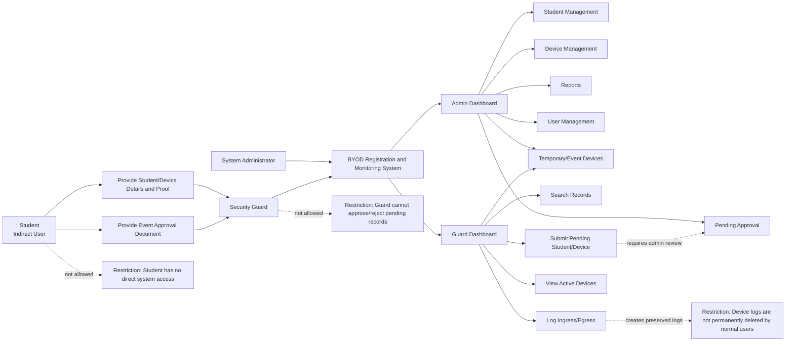

# 13 - User Interactions

## Purpose

This document explains what each user role can interact with in the BYOD Registration and Monitoring System. It is a role-based guide for what users can see, click, enter, update, approve, reject, generate, and view.

This document supports UI/UX design, JavaFX screen development, permission checks, and QA role-permission testing. Detailed screen fields and layout requirements remain in `07-screen-requirements.md`.

## User Interaction Diagram

## User Roles

| Role | System Access | Interaction Summary |
| --- | --- | --- |
| System Administrator | Direct user with full administrative access. | Manages official records, approvals, users, reports, and sensitive status changes. |
| Security Guard | Direct user with gate-monitoring access. | Searches records, logs ingress/egress, submits pending records, and records temporary/event devices at the gate. |
| Student | Indirect user with no login access. | Presents device, student details, proof, or event approval documents to authorized staff. |

## System Administrator Interactions

| Interaction Type | Details |
| --- | --- |
| Accessible Screens | Login, Admin Dashboard, Student Management, Device Management, Pending Registration Approval, Temporary/Event Device Registration, Ingress/Egress Monitoring, Active Devices, Reports, User Management. |
| Can View | Student records, device records, pending registrations, temporary/event devices, ingress/egress logs, active devices, reports, users, and audit-related information where implemented. |
| Can Enter | Student details, official device details, approval remarks, rejection reasons, event device details, report filters, and user account details. |
| Can Update | Student records, device records, device Active/Inactive status, pending registration decisions, temporary/event details, and user accounts. |
| Can Approve/Reject | Pending student records, pending device records, and pending registration corrections if implemented. |
| Can Generate | Daily, monthly, active devices, registered devices per student, pending registrations, rejected/inactive devices, temporary/event devices, and device history reports. |
| Cannot Perform | Actions outside the current desktop system scope, such as mobile/web self-registration, RFID/GPS tracking, or cloud synchronization. |

## Security Guard Interactions

| Interaction Type | Details |
| --- | --- |
| Accessible Screens | Login, Security Guard Dashboard, Quick Pending Registration, Temporary/Event Device Registration, Ingress/Egress Monitoring, Active Devices. |
| Can View | Search results, student/device details needed for gate verification, device status, campus status, pending warnings, active devices, temporary/event records, and recent monitoring details. |
| Can Enter | Search text, ingress remarks, egress remarks, pending student/device details, pending student proof details, temporary/event device details, paper approval or signed GPOA reference, and expected exit details. |
| Can Update | Ingress/egress transaction state through Log Ingress and Log Egress actions only. |
| Can Submit | Pending student records, pending device records, and temporary/event device entries at the gate. |
| Can Approve/Reject | None. Guards cannot approve or reject pending registrations and cannot make pending students official. |
| Cannot Perform | Manage users, approve/reject pending records, permanently delete logs, make official student records, change official device status, or edit administrative reports. |

## Student Interactions

Students are indirect users. They do not log in to the system in the current version.

| Interaction Type | Details |
| --- | --- |
| Can Provide | Student ID, name, course/section if needed, device details, serial number, identifying marks, school ID, registration form, enrollment record, or other school-approved proof. |
| Can Present | Device for visual inspection during ingress and egress. |
| Can Request | Device entry, device exit, pending registration submission, or event equipment entry through authorized staff. |
| Cannot Perform | Login, self-register, directly edit records, approve devices, generate reports, or access system data. |

## Interaction Matrix

| System Area | System Administrator | Security Guard | Student |
| --- | --- | --- | --- |
| Login | Can log in with admin account. | Can log in with guard account. | No login access. |
| Admin Dashboard | Can view and navigate. | No access. | No access. |
| Security Guard Dashboard | Optional access if allowed by implementation. | Can view and use for gate monitoring. | No access. |
| Student Management | Can add, update, search, and deactivate official student records. | Can search student records if available from guard screens. | Provides student details to staff. |
| Device Management | Can register, update, approve, reject, activate, and deactivate device records. | Can view device details through search and monitoring screens only. | Provides device details to staff. |
| Quick Pending Registration | Can review submitted records later through approval screens. | Can submit pending student/device records with required proof. | Provides proof and device details. |
| Pending Registration Approval | Can approve or reject pending student/device records. | No approval access. | No access. |
| Temporary/Event Device Registration | Can create or review temporary/event device records. | Can create temporary/event device records after checking paper approval or signed GPOA. | Responsible person or organization representative provides event details and approval proof. |
| Ingress/Egress Monitoring | Can view and perform monitoring actions if needed. | Can search, log ingress, and log egress. | Presents device for verification. |
| Active Devices | Can view active devices and automatic logout results. | Can view active devices for gate monitoring. | No access. |
| Reports | Can generate and view reports. | No report-generation access unless later allowed by policy. | No access. |
| User Management | Can add, update, deactivate, and reset user accounts. | No access. | No access. |

## Policy-Sensitive Interactions

| Policy Area | Interaction Rule |
| --- | --- |
| Pending student submission | Guards may submit pending student records only after manual verification with accepted proof. |
| Pending student approval | Only admins can make a pending student record Official. |
| Pending device entry | Guards may log temporary ingress for pending devices while waiting for admin approval. |
| Event device entry | Guards may record temporary/event devices at the gate after checking paper approval or signed GPOA. |
| Event device approval | Admin approval is not required before ingress under the current documented rule, but event approval proof must be recorded. |
| Device logs | Normal users cannot permanently delete logs. Corrections should use remarks or audit records. |
| Automatic logout | Devices still Inside at 10:00 PM are automatically logged out by the system with a system-generated remark. |

## Permission Summary

| Action | Admin | Guard | Student |
| --- | --- | --- | --- |
| Login | Yes | Yes | No |
| Search records | Yes | Yes | No |
| Add official student | Yes | No | No |
| Submit pending student | Review/approve only | Yes, with proof | Provides proof |
| Make pending student official | Yes | No | No |
| Register official BYOD device | Yes | No | No |
| Submit pending device | Review/approve only | Yes | Provides details |
| Approve/reject pending registration | Yes | No | No |
| Register temporary/event device | Yes | Yes, with approval proof | Provides event proof if responsible person |
| Log ingress | Yes | Yes | No |
| Log egress | Yes | Yes | No |
| View active devices | Yes | Yes | No |
| Generate reports | Yes | No | No |
| Manage users | Yes | No | No |
| Permanently delete logs | No | No | No |
