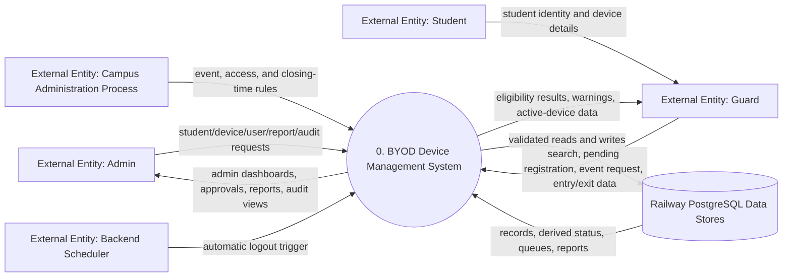
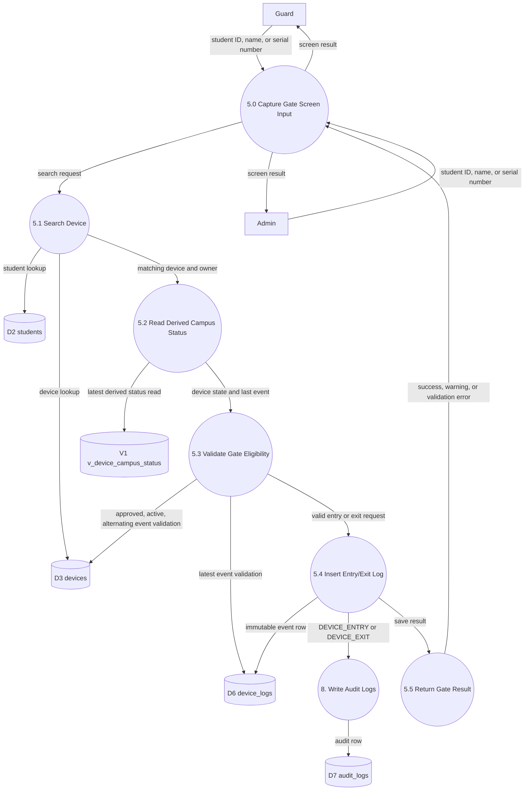
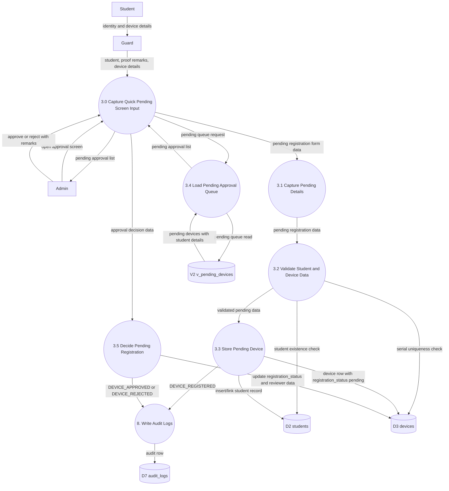
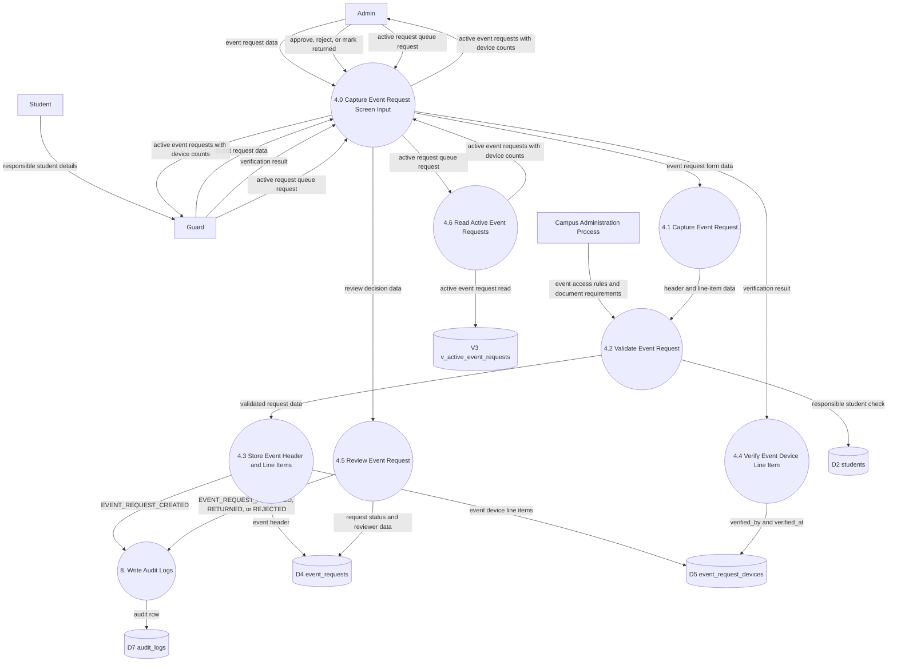

# 14 - Data Flow Diagrams

## Purpose

This document defines the formal Data Flow Diagram (DFD) package for the BYOD Device Management System. It describes how data moves between external actors, the JavaFX desktop frontend, the Spring Boot backend processes, and Railway PostgreSQL data stores.

The DFDs are documentation only. They do not change the schema, API, or application source code.

## DFD Notation

| DFD Element | Representation In This Document | Meaning |
| --- | --- | --- |
| External entity | Named actor node | A person, organization process, or system outside the BYOD application boundary. |
| Process | Numbered process node | A transformation or validation step performed by the system. |
| Data store | `D#` data store node | A persistent PostgreSQL table or derived read view. |
| Data flow | Labeled arrow | Data passed between entities, processes, and stores. |

All write access to PostgreSQL flows through Spring Boot backend processes. The JavaFX frontend never reads or writes the database directly.

## DFD Level 0 - Context Diagram

Level 0 treats the whole BYOD system as one process.

Source: `../architecture/diagrams/mermaid/dfd-level-0-context.mmd`

## DFD Level 1 - System Processes

Level 1 decomposes the system into major data processes and stores.

```mermaid
flowchart TB
    Admin["Admin"]
    Guard["Guard"]
    Student["Student"]
    Policy["Campus Administration Process"]
    Scheduler["Backend Scheduler"]

    P0(("0.1 Capture and Present JavaFX UI Data"))
    P1(("1. Authenticate User"))
    P2(("2. Manage Students"))
    P3(("3. Manage Devices and Pending Approval"))
    P4(("4. Manage Event Requests"))
    P5(("5. Log Entry/Exit"))
    P6(("6. Generate Reports"))
    P7(("7. Manage Users"))
    P8(("8. Write Audit Logs"))
    P9(("9. Run Automatic Logout"))

    D1[("D1 users")]
    D2[("D2 students")]
    D3[("D3 devices")]
    D4[("D4 event_requests")]
    D5[("D5 event_request_devices")]
    D6[("D6 device_logs")]
    D7[("D7 audit_logs")]
    V1[("V1 derived views")]

    Admin -->|"screen input and commands"| P0
    Guard -->|"screen input and commands"| P0
    P0 -->|"credentials"| P1
    P1 <-->|"account and role data"| D1
    P1 -->|"login events"| P8

    P0 -->|"student maintenance data"| P2
    P0 -->|"student data through pending flow"| P2
    P2 <-->|"student records"| D2
    P2 --> P8

    P0 -->|"device registration and decisions"| P3
    P0 -->|"pending device submission"| P3
    Student -->|"identity and device details"| Guard
    P3 <-->|"device records"| D3
    P3 -->|"pending queue reads"| V1
    P3 --> P8

    P0 -->|"event request decisions"| P4
    P0 -->|"event request and verification data"| P4
    Policy -->|"event access rules"| P4
    P4 <-->|"event headers"| D4
    P4 <-->|"event device line items"| D5
    P4 -->|"active event request reads"| V1
    P4 --> P8

    P0 -->|"entry/exit action and notes"| P5
    P0 -->|"entry/exit action when needed"| P5
    P5 -->|"device eligibility reads"| D3
    P5 -->|"student display reads"| D2
    P5 <-->|"gate event rows"| D6
    P5 -->|"derived status reads"| V1
    P5 --> P8

    P0 -->|"report filters"| P6
    P6 -->|"student/device/log/event/audit reads"| D2
    P6 --> D3
    P6 --> D4
    P6 --> D5
    P6 --> D6
    P6 --> D7
    P6 --> V1
    P6 -->|"report results"| P0

    P0 -->|"user account changes"| P7
    P7 <-->|"user records"| D1
    P7 --> P8

    Scheduler -->|"closing-time run signal"| P9
    P9 -->|"inside-device reads"| V1
    P9 -->|"automatic exit rows"| D6
    P9 --> P8

    P8 -->|"standard audit rows"| D7
    P1 -->|"login result"| P0
    P2 -->|"student save/search result"| P0
    P3 -->|"device queue/decision result"| P0
    P4 -->|"event request result"| P0
    P5 -->|"gate action result"| P0
    P7 -->|"user management result"| P0
    P0 -->|"screen results and alerts"| Admin
    P0 -->|"screen results and alerts"| Guard
```

Source: `../architecture/diagrams/mermaid/dfd-level-1-system.mmd`

## DFD Level 2 - Gate Monitoring

This DFD details device search, eligibility checking, entry/exit logging, derived campus status, and audit writing.

Source: `../architecture/diagrams/mermaid/dfd-level-2-gate-monitoring.mmd`

## DFD Level 2 - Pending Registration

This DFD details quick pending submission and admin approval/rejection. Pending devices are stored in `devices` but are not gate-loggable until approved.

Source: `../architecture/diagrams/mermaid/dfd-level-2-pending-registration.mmd`

## DFD Level 2 - Event Requests

This DFD details event request headers, line-item devices, verification, and reporting data. Event request devices are request/verification records only unless a future schema relationship is added.

Source: `../architecture/diagrams/mermaid/dfd-level-2-event-requests.mmd`

## DFD Control Notes

| Area | Required DFD Rule |
| --- | --- |
| Frontend/database access | JavaFX sends data to Spring Boot only; it does not directly access PostgreSQL. |
| Pending devices | Pending devices flow to approval data stores and queues, not to gate logs. |
| Event request devices | Event request device rows are request/verification records; direct gate-log linkage is an open schema decision. |
| Audit | Sensitive actions flow through the audit process and then to `audit_logs`. |
| Derived views | Views are read-only DFD stores used for status, pending queue, and active event request reads. |
