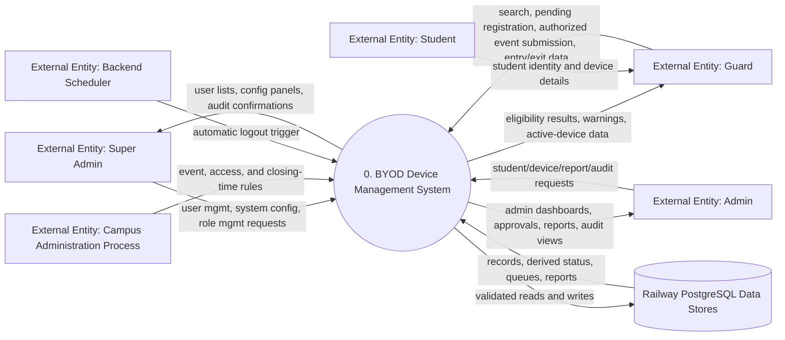
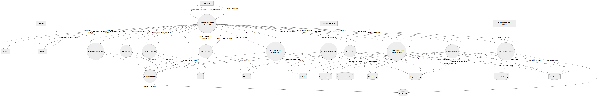
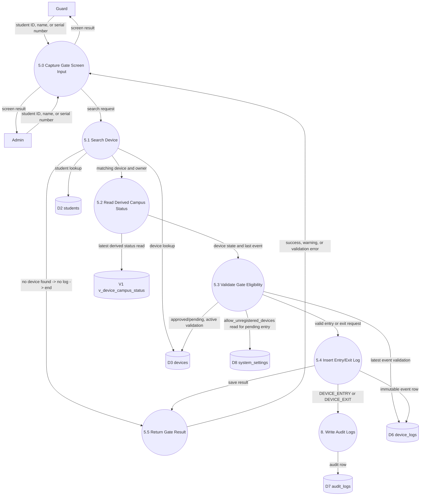
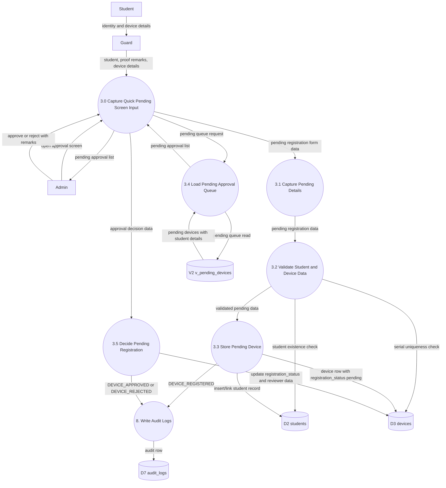
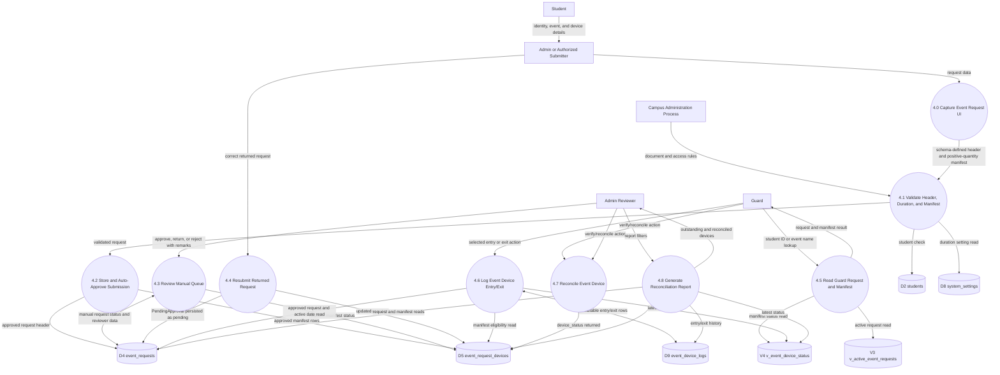
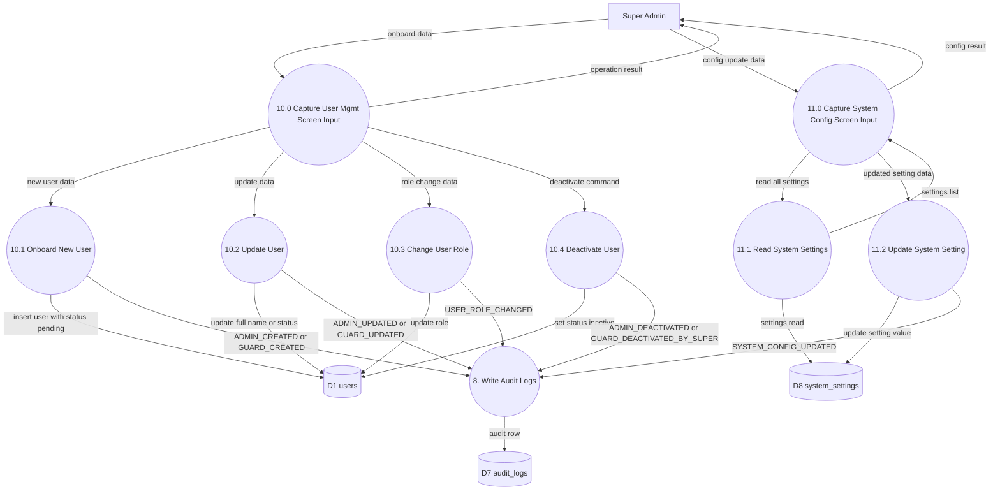

# 14 - Data Flow Diagrams

## Purpose

This document defines the formal Data Flow Diagram (DFD) package for the BYOD Device Management System. It describes how data moves between external actors, the JavaFX desktop frontend, the Spring Boot backend processes, and Railway PostgreSQL data stores.

The DFDs are documentation only. They do not change the schema, API, or application source code.

## DFD Notation

| DFD Element | Representation In This Document | Meaning |
| --- | --- | --- |
| External entity | Named actor node | A person, organization process, or system outside the BYOD application boundary. |
| Process | Numbered process node | A transformation or validation step performed by the system. |
| Data store | D# data store node | A persistent PostgreSQL table or derived read view. |
| Data flow | Labeled arrow | Data passed between entities, processes, and stores. |

All write access to PostgreSQL flows through Spring Boot backend processes. The JavaFX frontend never reads or writes the database directly.

## DFD Level 0 - Context Diagram

Level 0 treats the whole BYOD system as one process.

Source: ../architecture/diagrams/mermaid/dfd-level-0-context.mmd

## DFD Level 1 - System Processes

Level 1 decomposes the system into major data processes and stores.

```mermaid
flowchart TB
    SuperAdmin["Super Admin"]
    Admin["Admin"]
    Guard["Guard"]
    Student["Student"]
    Policy["Campus Administration Process"]
    Scheduler["Backend Scheduler"]

    P0(("0.1 Capture and Present JavaFX UI Data"))
    P1(("1. Authenticate User"))
    P2(("2. Manage Students"))
    P3(("3. Manage Devices and Pending Approval"))
    P4(("4. Manage Event Requests"))
    P5(("5. Log Entry/Exit"))
    P6(("6. Generate Reports"))
    P7(("7. Manage Profile"))
    P8(("8. Write Audit Logs"))
    P9(("9. Run Automatic Logout"))
    P10(("10. Manage System Users"))
    P11(("11. Manage System Configuration"))

    D1[("D1 users")]
    D2[("D2 students")]
    D3[("D3 devices")]
    D4[("D4 event_requests")]
    D5[("D5 event_request_devices")]
    D6[("D6 device_logs")]
    D7[("D7 audit_logs")]
    D8[("D8 system_settings")]
    D9[("D9 event_device_logs")]
    V1[("V1 derived views")]

    SuperAdmin -->|"screen input and commands"| P0
    Admin -->|"screen input and commands"| P0
    Guard -->|"screen input and commands"| P0
    P0 -->|"credentials"| P1
    P1 <-->|"account and role data"| D1
    P1 -->|"login events"| P8

    P0 -->|"student maintenance data"| P2
    P0 -->|"student data through pending flow"| P2
    P2 <-->|"student records"| D2
    P2 --> P8

    P0 -->|"device registration and decisions"| P3
    P0 -->|"pending device submission"| P3
    Student -->|"identity and device details"| Guard
    P3 <-->|"device records"| D3
    P3 -->|"pending queue reads"| V1
    P3 -->|"system settings check"| D8
    P3 --> P8

    P0 -->|"event submission, review, scan, reconciliation"| P4
    Policy -->|"event access rules"| P4
    P4 <-->|"event headers"| D4
    P4 <-->|"event device line items"| D5
    P4 <-->|"event entry/exit rows"| D9
    P4 -->|"duration and policy reads"| D8
    P4 -->|"active event request reads"| V1
    P4 -->|"event device status reads"| V1

    P0 -->|"entry/exit action and notes"| P5
    P5 -->|"device eligibility reads"| D3
    P5 -->|"student display reads"| D2
    P5 <-->|"gate event rows"| D6
    P5 -->|"derived status reads"| V1
    P5 -->|"system settings check"| D8
    P5 --> P8

    P0 -->|"report filters"| P6
    P6 -->|"student/device/log/event/audit reads"| D2
    P6 --> D3
    P6 --> D4
    P6 --> D5
    P6 --> D6
    P6 --> D7
    P6 --> D9
    P6 --> V1
    P6 -->|"report results"| P0

    P0 -->|"profile update data"| P7
    P7 <-->|"user records"| D1
    P7 --> P8

    Scheduler -->|"closing-time run signal"| P9
    P9 -->|"inside-device reads"| V1
    P9 -->|"automatic exit rows"| D6
    P9 --> P8

    P0 -->|"user account changes"| P10
    SuperAdmin -->|"user mgmt commands"| P0
    P10 <-->|"user records"| D1
    P10 --> P8

    P0 -->|"system setting changes"| P11
    SuperAdmin -->|"system config commands"| P0
    P11 <-->|"system settings"| D8
    P11 --> P8

    P8 -->|"standard audit rows"| D7
    P1 -->|"login result"| P0
    P2 -->|"student save/search result"| P0
    P3 -->|"device queue/decision result"| P0
    P4 -->|"event request result"| P0
    P5 -->|"gate action result"| P0
    P7 -->|"profile update result"| P0
    P10 -->|"user management result"| P0
    P11 -->|"system config result"| P0
    P0 -->|"screen results and alerts"| SuperAdmin
    P0 -->|"screen results and alerts"| Admin
    P0 -->|"screen results and alerts"| Guard
```

Source: ../architecture/diagrams/mermaid/dfd-level-1-system.mmd

## DFD Level 2 - Gate Monitoring

This DFD details device search, eligibility checking, entry/exit logging, derived campus status, and audit writing.

Note: Students without devices pass through the gate without any system interaction. No process node or data flow is triggered in the DFD for deviceless gate passage.

Source: ../architecture/diagrams/mermaid/dfd-level-2-gate-monitoring.mmd

## DFD Level 2 - Pending Registration

This DFD details quick pending submission and admin approval/rejection. Active pending devices are stored in devices and may be checked in while allow_unregistered_devices is true.

Source: ../architecture/diagrams/mermaid/dfd-level-2-pending-registration.mmd

## DFD Level 2 - Event Requests

This DFD details request auto-approval/manual review, positive-quantity manifests, event-device scanning, reconciliation, reporting, and settings.

Source: ../architecture/diagrams/mermaid/dfd-level-2-event-requests.mmd

## DFD Level 2 - Super Admin System Management

This DFD details Super Admin user management, role assignment, and system configuration processes.

Source: ../architecture/diagrams/mermaid/dfd-level-2-super-admin-system-management.mmd

## DFD Control Notes

| Area | Required DFD Rule |
| --- | --- |
| Frontend/database access | JavaFX sends data to Spring Boot only; it does not directly access PostgreSQL. |
| Pending devices | Active pending devices may receive an entry row when allow_unregistered_devices is true. |
| Deviceless gate passage | Students without devices generate no DFD flows; the gate process terminates with no system event. |
| Event request devices | A manifest row has quantity > 0, defaults to 1, and is the row referenced by event_device_logs. |
| Event reconciliation | Reconciled workflow state is persisted as event_request_devices.device_status = 'returned'. |
| Audit | Actions with defined audit behavior flow through Process 8. The final schema defines EVENT_REQUEST_* action values, but the event workflow does not itself state when those audit rows are written. |
| Derived views | Views are read-only stores for permanent status, pending queue, active requests, and event-device status. |
| System settings | D8 system_settings is read by Process 3 (device registration) and Process 5 (gate monitoring) to enforce configurable policy. It is written only by Process 11 (Manage System Configuration). |
| Super Admin scope | Processes 10 and 11 are exclusively accessible to the super_admin role. |
